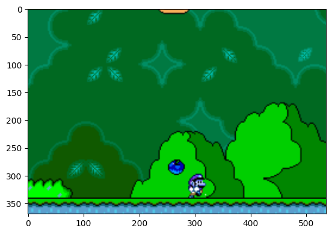

# Super_Mario_World Agent

## About Project

 This is a deep Q learning agent that learns to play mario from frames (images) inputs\
\
 Single raw frame:\

## About the model

### Deep Q-Networks (DQN)

Deep Q-Networks (DQN) are a class of deep reinforcement learning algorithms introduced by Mnih et al. in 2015. They combine deep neural networks with Q-learning, enabling agents to learn directly from high-dimensional sensory inputs, such as raw pixel data, to achieve human-level control in various tasks, including playing Atari games.

## References

Mnih, V., Kavukcuoglu, K., Silver, D. et al. Human-level control through deep reinforcement learning. Nature 518, 529–533 (2015). https://doi.org/10.1038/nature14236